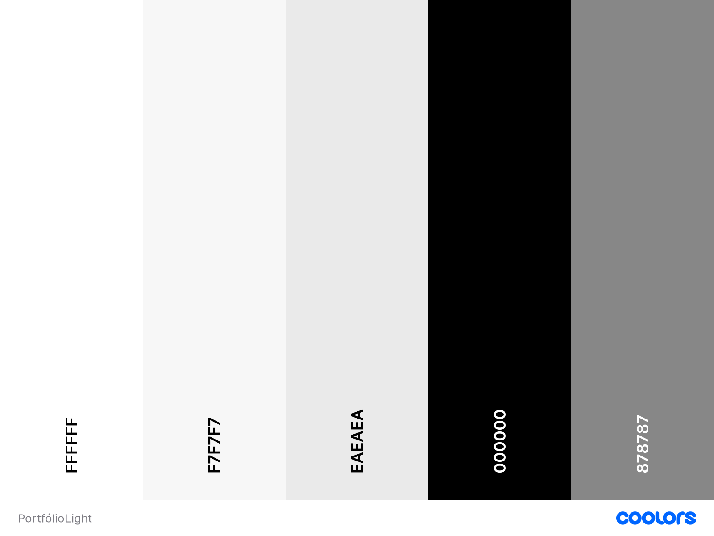
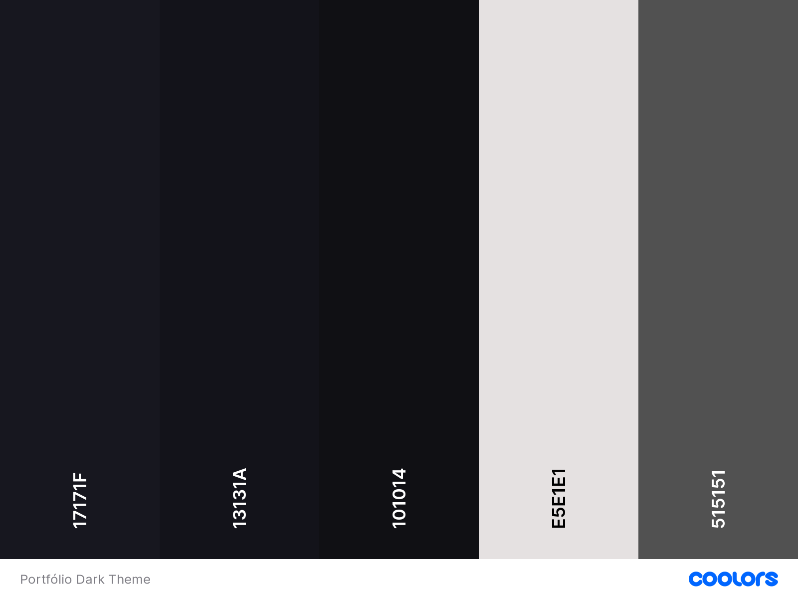

# Portfólio
 

## Sobre
• O portfólio foi concebido como uma plataforma para exibir meus projetos, destacar minhas habilidades e apresentar uma versão mais pessoal e descontraída de mim mesmo.
 
## Design
• Idealizado com o objetivo de ter um design mais elegante e suave, o projeto apresenta um ambiente minimalista, priorizando a harmonia entre as cores para oferecer uma experiência agradável ao usuário.

• O memoji foi incorporado ao projeto com o objetivo de dinamizar a página, mantendo minha essência atrelada a identidade descontraída da tecnologia.

<h4>Paleta de cores</h4>

| Light Theme | Dark Theme |
|----------|----------|
|  |   |
 
## Tecnologias

- ``HTML5``
- ``CSS3``
- ``JavaScript``
- ``VS Code``
 
## Sites

- Icones -> [Icons8](https://icons8.com.br/) 
- Memoji -> [Apple](https://apps.apple.com/br/app/memoji/id1526384700)
- Fonte -> [Google Fonts](https://fonts.google.com)
- Paleta de Cores -> [Coolors](https://coolors.co)